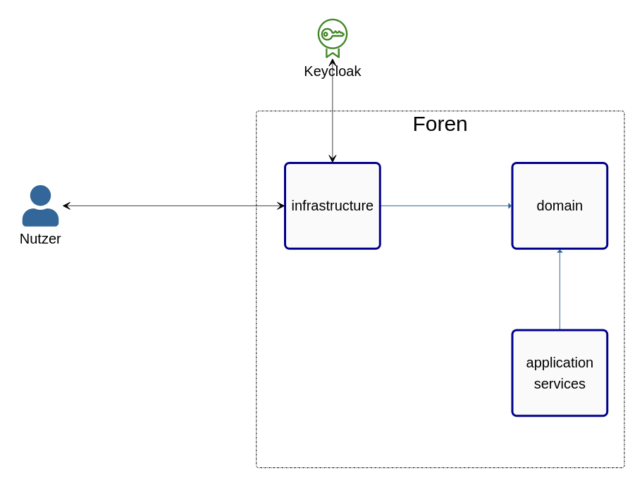
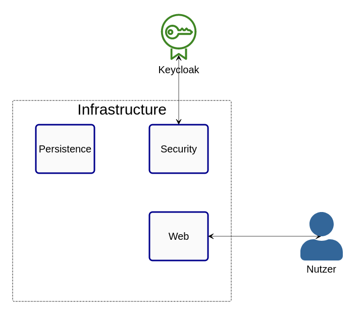
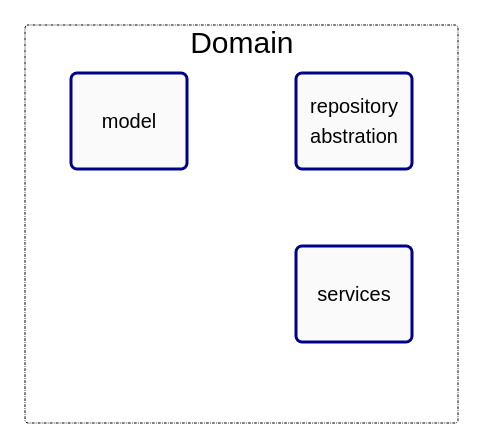

= Dokumentation des Projekts "Foren" mit ARC42

==	Einführung und Ziele

=== Aufgabenstellung

Das Team implementiert ein Self-Contained-System "Foren", welches die Kommunikation zwischen Studenten, Organisatoren und Admins des Systems MOPS ermöglichen soll.

=== Qualitätsziele

- das Subsystem soll mindestens grundlegende Funktionalität eines Forums bereitstellen
- übersichtliche und benutzerfreundliche Strukturierung des Subsystems
- das Subsystem soll die Rollen `Administrator`, `Moderator` und `Student` erkennen und Interaktionsmöglichkeiten klar differenzieren können
- die Performance sollte der Aufgabe entsprechend verhältnismäßig sein

=== Stakeholder

[cols="1,1,2" options="header"]
|===
|Name | Rolle | Funktion/Motivation
| _Jens Bendisposto_ | _Kunde_ | _Erwartet die Einhaltung aller Qualitätsziele, entscheidet über den Erfolg des Subsystems_
| _TeamyMcTeamFace_ | _Entwicklerteam_ | _Implementiert das Subsystem, sind auf Erfolg dessen angewiesen_
|===

== Randbedingungen

- das Subsystem wir in SpringBoot entwickelt
- der Zeitraum der Entwicklung beträgt min.
80 Stunden
- das Team operiert nach eigenen Regeln mit festgelegten Workflows
- Style der Website ist vorgegeben
- Keycloak zur Authentifizierung muss eingebunden werden

== Kontextabgrenzung

Die Kontextabgrenzung haben wir in einem Diagramm festgehalten.
Sie ist möglichst abstrakt gestaltet, um grundlegende Interaktionen zu fixieren.

image::Foren_ Kontextdiagramm.jpg[500,600]

== Lösungsstrategie

Folgende Entscheidungen wurden getroffen, um die geforderten Qualitätsziele zu erreichen.

=== Technnologieentscheidungen

* Checkstyle und Spotbugs Plugin
* Spring Data JPA
* Hibernate
* MySQL
* Lombok
* Thymeleaf

=== organisatorische Entscheidungen

* XP (ohne TDD)
* Anleihen aus Kanban (mithilfe von Trello)
* Retrospektiven
* Reglement für Codestil, Formatierungen und Entscheidungsfindung

=== top-level Entscheidungen

* OnionArchitektur

== Bausteinsicht

====
Wir brechen das System in der Bausteinsicht nicht bis aus Klassenebene herunter, für die Funktionalität der einzelnen Funktionen gibt es die Javadocs
====

=== Ebene 1

====
Keycloak ist ein externes System, der Nutzer wird auch als solches angesehen
====

[cols = "1,1" options="header"]
|===
|Paket| Beschreibung
|Domain| Enthällt die Inhaltliche Logik
|Infrastruktur| Abhänig von Domain: Enthällt alle Funktionen zur technischen Umsetzung
|ApplicationServices| Abhänig von Domain: Enthält die der Anwendung zut Verfügung stehenden Services
|===

=== Ebene 2

==== infrastructure Paket

[cols = "1,1" options="header"]
|===
|Paket| Beschreibung
|Persistence| Enthällt die Kommunikaton zur Datenbank
|Security| Enthält Spring Security und die Kommunikation zu Keycloak
|Web| Enthält die Kontroller und weitere benötigte Webklassen
|===

==== domain Paket

[cols = "1,1" options="header"]
|===
|Paket| Beschreibung
|model| Enthällt die inhaltliche Logik
|repositoryabstration| Enthält Interfaces der Repositories, welche in der Infrastruktur implementiert werden
|services| Enthält für die Logik relevante Services
|===

==== applicationServices Paket

Dieses Paket enthält keine untergeordneten Paket, sondern nur einzelne Klassen.

== Laufzeitsicht

image::Laufzeit_Diagramm.png[]

==== Typischer Ablauf :

Greift ein Nutzer auf das System Foren zu wird dieser zunächst an Keycloak weitergeleitet um sich dort zu authentifizieren.

Möchte der Nutzer nun eine Aktion durchführen(z.B ein Forum einsehen oder einen neuen Post schreiben) so wird diese Anfrage vom zuständigen Controller bearbeiter.
Aus dem Keycloak Token wird der korrespondierende User aus der Datenbank geholt und über desen Permission Manager eine Rechteanfrage durchgeführt.

Verläuft diese negativ, so gibt der Controller eine Seite zurück die dem Nutzer dies entsprechend mitteilt.
Hat der Nutzer die geforderten Rechte so stößt der Controller die geforderte Aktion an.

In den meisten Fällen bedeutet dies, dass dem Nutzer eine Seite zurück gegeben wird, deren Inhalt(Topics, Threads etc.) über die Services aus der Datenbank gefüllt werden.

Von dieser Seite aus kann der Nutzer eine neue Anfrage stellen.

== Verteilungsschicht

Das System wird als Docker-compose ausgeliefert.
Es benötigt also lediglich eine Docker-compose fähige Umgebung um in Betrieb genommen zu werden.

== Entwurfsentscheidungen

== Risikobewertung

[cols="1,2" options="header"]
|===

|Name |Beschreibung | _Konfiguration und Verwaltung des Projekts_ | _das Team besitzt keine fundierte Erfahrung im Konfigurieren und Entwickeln einer Webanwendung dieser Größe.
Des Weiteren ist mit einem hohen Koordinationsaufwand zu rechnen, der zu unerwarteten Problemen führen kann.
Das Team versucht dem mit festgelegten Workflows entgegenzuwirken._ | _Keine Multiuser möglich_ | _das Team versucht eine Webanwendung zu entwickeln, welche auch multiple User korrekt behandeln kann.
Da Erfahrungen im Team in diesem Bereich fehlen, kann das zu unerwarteten Problemen führen_ | _Datenlecks der Rechte_ | _eine Kompromittierung von sicherheitsrelevanten Daten, könnte auch in externen Systemen Probleme auslösen.
Mit besonderer Aufmerksamkeit im Bereich Security versucht das Team dies zu verhindern._

|===

== Glossar

* TOPIC - ein übergreifender Beitrag in einem Forum z.B. "Ankündigungen"
* THREAD - ein einzelner Beitrag einem Topic z.B. eine Frage.

== Weitere Dokumentationen

Unsere Teamdokumentation finden Sie link:teamdocumentation.adoc[hier]