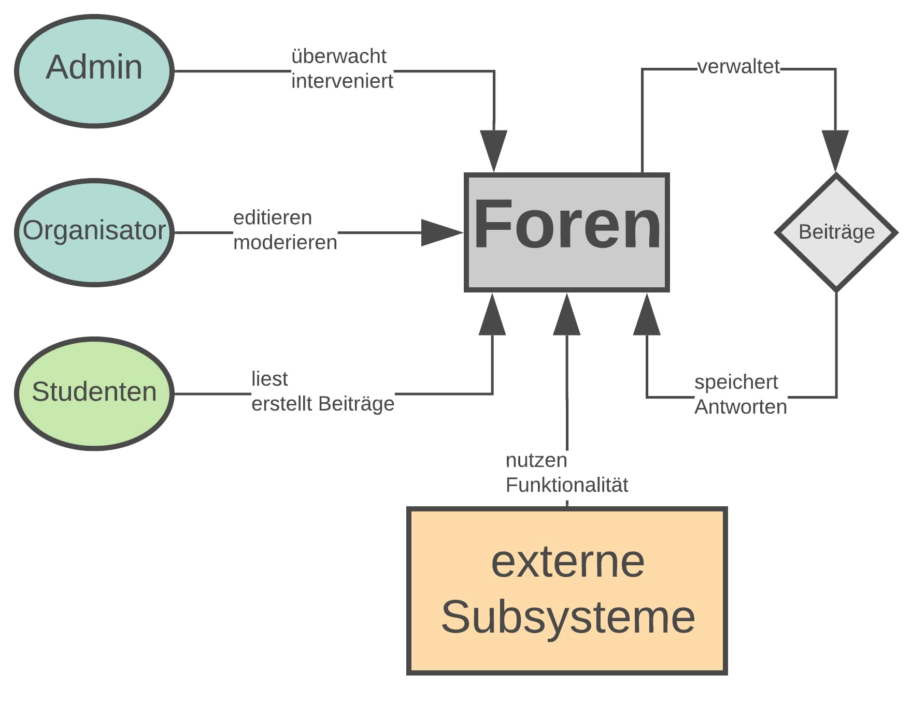

= Dokumentation des Projekts "Foren" mit ARC42

==	Einführung und Ziele

=== Aufgabenstellung

Das Team implementiert ein Self-Contained-System "Foren", welches die Kommunikation zwischen Studenten, Organisatoren und Admins des Systems MOPS ermöglichen soll.

=== Qualitätsziele

- das Subsystem soll mindestens grundlegende Funktionalität eines Forums bereitstellen
- übersichtliche und benutzerfreundliche Strukturierung des Subsystems
- das Subsystem soll die Rollen `Administrator`, `Moderator` und `Student` erkennen und Interaktionsmöglichkeiten klar differenzieren können
- die Performance sollte der Aufgabe entsprechend verhältnismäßig sein

=== Stakeholder

[cols="1,1,2" options="header"]
|===
|Name | Rolle | Funktion/Motivation
| _Jens Bendisposto_ | _Kunde_ | _Erwartet die Einhaltung aller Qualitätsziele, entscheidet über den Erfolg des Subsystems_
| _TeamyMcTeamFace_ | _Entwicklerteam_ | _Implementiert das Subsystem, sind auf Erfolg dessen angewiesen_
|===

== Randbedingungen

- das Subsystem wir in SpringBoot entwickelt
- der Zeitraum der Entwicklung beträgt min.
80 Stunden
- das Team operiert nach eigenen Regeln mit festgelegten Workflows
- Style der Website, sowie Login/Logout sind vorgegeben

== Kontextabgrenzung

Die Kontextabgrenzung haben wir in einem Diagramm festgehalten.
Sie ist möglichst abstrakt gestaltet, um grundlegende Interaktionen zu fixieren.

== Lösungsstrategie

Folgende Entscheidungen wurden getroffen, um die geforderten Qualitätsziele zu erreichen.

=== Technnologieentscheidungen

* Trello (Workflow und Regeln)
* Checkstyle und Spotbugs Plugin
* Spring Data JPA
* Hibernate
* MySQL
* Lombok

=== organisatorische Entscheidungen

* XP (ohne TDD)
* Anleihen aus Kanban
* Retrospektiven
* Reglement für Codestil, Formatierungen und Entscheidungsfindung

=== top-level Entscheidungen

* OnionArchitektur

== Bausteinsicht

== Laufzeitsicht

== Verteilungsschicht

== Entwurfsentscheidungen

== Risikobewertung

[cols="1,2" options="header"]
|===
|Name |Beschreibung
| _Konfiguration und Verwaltung des Projekts_ | _das Team besitzt keine fundierte Erfahrung im Konfigurieren und Entwickeln einer Webanwendung dieser Größe. Des Weiteren ist mit einem hohen Koordinationsaufwand zu rechnen, der zu unerwarteten Problemen führen kann. Das Team versucht dem mit festgelegten Workflows entgegenzuwirken._
| _Keine Multiuser möglich_ | _das Team versucht eine Webanwendung zu entwickeln, welche auch multiple User korrekt behandeln kann. Da Erfahrungen im Team in diesem Bereich fehlen, kann das zu unerwarteten Problemen führen_
| _Datenlecks der Rechte_ | _eine Kompromittierung von sicherheitsrelevanten Daten, könnte auch in externen Systemen Probleme auslösen. Mit besonderer Aufmerksamkeit im Bereich Security versucht das Team dies zu verhindern._
|===

== Glossar

* TOPIC - ein übergreifender Beitrag in einem Forum z.B. "Ankündigungen"
* THREAD - ein einzelner Beitrag einem Topic z.B. eine Frage.

== Weitere Dokumentationen

Unsere Teamdokumentation finden Sie link:teamdocumentation.adoc[hier]