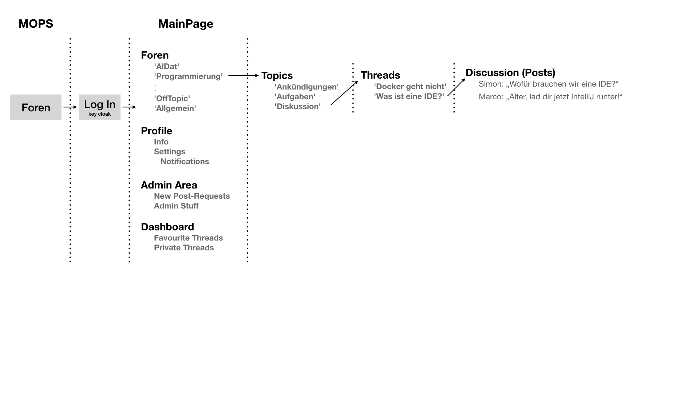

= Softwareentwicklung im Team: Teamy McTeamFace
:icons: font
:icon-set: octicon
:source-highlighter: rouge
ifdef::env-github[]
:tip-caption: :bulb:
:note-caption: :information_source:
:important-caption: :heavy_exclamation_mark:
:caution-caption: :fire:
:warning-caption: :warning:
endif::[]

== Foren

==== Problemstellung
Der Austausch von Informationen sowie die Diskussion zwischen Studierenden, Dozenten und Mitarbeitern ist über
vorhandene Wege, wie z.B. E-Mail, sehr mühselig und ineffizient.

==== Wesentliche Features

* Zentraler Ort zum Austausch zwischen Studierenden und Mitarbeitern

* Aufteilung in verschieden Foren je nach Kurs, Gruppe, Thema

* ermöglicht Anonyme Posts

* individuelle Benachrichtigungseinstellungen

* Themenbereiche können im Moderationsmodus erstellt werden, sprich jeder Beitrag muss freigegeben werden

* ermöglicht dem User seine/ihre Startseite zu personalisieren

* weist dem User automatisch die eigenen Foren zu (entsprechend der Gruppen aus dem Gruppenbildungsmodul)

==== Dokumentationen

* Trello : Wir nutzen ein Trello Board um unsere Aufgaben zu koordinieren und einige generelle Infos zu sammeln.
Das ist aktuell Team-Private, wir können aber bei Interesse gerne Korrektoren / Dozenten hinzufügen.

* Organisation des Forums

* link:Documentation/structure.adoc[Structure] : Allgemeine Infos über die Klassenstruktur etc.

* link:Documentation/documentation.adoc[ARC42 Doc] : Struktur Doku anhand von ARC42

* link:Documentation/teamdocumentation.adoc[Team Doc] : Dokumentation der Teamarbeit